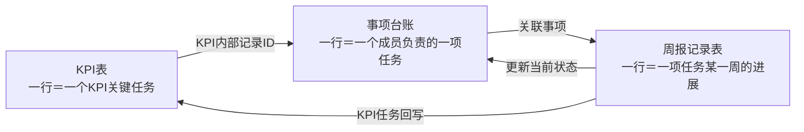

# 供应链信息化团队周报三表关联优化方案

日期：2026-09-14

## 1. 背景与问题

目前团队同时维护 KPI 表和周报记录表。现有周报记录表将任务基础信息、当前状态和每周进展混合在一张宽表中，主要产生以下问题：

1. KPI 表与周报记录表没有关联，KPI 项目的名称、任务、责任人和计划等信息需要重复维护。
2. `W37-主要进展`、`W37-存在问题`等按周增加的字段会使表格越来越宽，填写和读取都不方便。
3. `上周进度`、`本周进度`与周次字段表达的信息重复，历史数据难以统一查询。
4. 周会按成员逐人汇报，但原表混有全部项目，无法自然筛选出某个成员本周真正更新的任务。
5. 同一项目可能由多名成员负责不同任务，不能简单按项目名称合并。

本方案在不改变 KPI 表结构的前提下，引入“事项台账”，形成“项目任务主数据—当前状态—每周历史记录”三层数据结构。

## 2. 总体方案

三张表的定位如下：

| 表格 | 记录粒度 | 主要用途 |
|---|---|---|
| KPI 表 | 一行一个 KPI 关键任务 | 保留公司既有 KPI 管理结构 |
| 事项台账 | 一行一个成员负责的一项任务 | 统一管理 KPI、非 KPI 需求和临时任务 |
| 周报记录表 | 一行是一项任务在某一周的进展 | 保存每周历史，支持成员汇报和 AI 总结 |

关联关系：

核心原则：

- KPI 表字段、名称和顺序保持不变。
- 事项台账负责保存“任务是什么、谁负责、当前是什么状态”。
- 周报记录表负责保存“某项任务在某一周发生了什么”。
- 同一项目下不同成员负责的不同任务，建立不同事项，不做项目级合并。
- 每周记录按行纵向增加，不再按周次增加字段。
- 周报历史直接保存在周报记录表中，不需要额外增加快照表。
- 某项任务当周没有周报记录，则不在当周 HTML 汇报页中展示。

## 3. KPI 表

### 3.1 现有结构保持不变

KPI 表继续使用以下字段：

`项目集、项目名称、关键任务、主要内容、优先级、优化流程数量、优化系统功能点、项目收益（预估收益 验收实际收益）、单项责任人、当前状态、完成比例、计划比例、灯光、进度说明、实际上线时间、对应痛点码、计划开始时间、计划完成时间、IT产品Owener、IT开发、涉及系统、阶段（plan actual）`

### 3.2 记录粒度

KPI 表一行代表：

> 一个项目下，由一个责任人负责的一项 KPI 关键任务。

KPI 表不新增“事项 ID”等字段。系统读取 WPS 每一行自带的内部记录 ID，并将该 ID 保存在事项台账的“KPI记录ID”字段中。

### 3.3 允许回写的字段

周报提交后，只允许自动回写以下四个既有字段：

- 当前状态
- 完成比例
- 灯光
- 进度说明

其他 KPI 字段仍按原有管理流程维护。

## 4. 事项台账

事项台账是三张表之间的连接中心，统一管理 KPI 项目、非 KPI 需求和临时任务。

### 4.1 建议字段

| 字段 | 类型 | 维护方式 | 说明 |
|---|---|---|---|
| 事项ID | 自动编号 | 系统 | 稳定的业务关联标识，例如 `SX-0001` |
| 事项类型 | 单选 | 系统/成员 | KPI项目、非KPI需求、临时任务 |
| KPI记录ID | 单行文本 | 系统 | KPI事项对应的WPS内部记录ID；非KPI为空 |
| 项目集 | 单行文本 | 同步/填写 | KPI同步或非KPI人工填写 |
| 项目名称 | 单行文本 | 同步/填写 | 项目或需求名称 |
| 任务名称 | 单行文本 | 同步/填写 | KPI表中的关键任务或非KPI任务名称 |
| 任务内容 | 多行文本 | 同步/填写 | 工作范围和任务说明 |
| 业务价值点 | 多行文本 | 同步/填写 | 任务预期产生的业务价值 |
| 任务级别 | 单选 | 成员/维护人员 | 沿用部门现有定义 |
| 优先级 | 单选 | 同步/填写 | 沿用部门现有定义 |
| 计划开始时间 | 日期 | 同步/填写 | 基础计划开始日期 |
| 计划完成时间 | 日期 | 同步/填写 | 基础计划完成日期 |
| 责任人 | 成员/单选 | 同步/填写 | HTML周会页面的成员归组依据 |
| 业务接口人 | 成员/文本 | 同步/填写 | 业务侧接口人 |
| IT接口人 | 成员/文本 | 同步/填写 | IT侧接口人 |
| 当前状态 | 单选 | 周报更新 | 未开始、进行中、暂停、已完成 |
| 当前完成比例 | 百分比 | 周报更新 | 最近一周提交后的实际完成比例 |
| 最新进度说明 | 多行文本 | 周报更新 | 最近一周的主要进展 |
| 数据来源 | 单选 | 系统 | KPI同步、人工创建 |
| 是否有效 | 单选 | 系统/维护人员 | 在途、已关闭、已归档 |
| 最后同步时间 | 日期时间 | 系统 | 最近一次成功同步时间 |

### 4.2 示例

| 事项ID | 事项类型 | 项目名称 | 任务名称 | 责任人 | 当前状态 | 当前完成比例 | 数据来源 |
|---|---|---|---|---|---|---:|---|
| SX-0001 | KPI项目 | 供应商协同平台 | 主数据治理规则建设 | 张敏 | 进行中 | 65% | KPI同步 |
| SX-0002 | KPI项目 | 供应商协同平台 | 供应商门户上线 | 李强 | 进行中 | 40% | KPI同步 |
| SX-0003 | 非KPI需求 | 仓储异常看板 | 异常预警逻辑设计 | 王芳 | 进行中 | 70% | 人工创建 |
| SX-0004 | 临时任务 | 月度经营会议 | 供应链数据准备 | 张敏 | 已完成 | 100% | 人工创建 |

示例中，张敏和李强虽然参与同一个“供应商协同平台”，但负责的任务不同，因此建立两条独立事项，分别用于填报和汇报。

## 5. 周报记录表

### 5.1 设计原则

周报记录表不再重复保存项目名称、任务名称、计划日期和接口人等基础资料，而是通过“关联事项”引用事项台账。

一条任务周报记录代表：

> 某一项事项在某一个周报周期内，由责任人提交的一次周进展。

任务进展记录的唯一规则为：

> `周报周期＋关联事项`唯一。

同一事项同一周重复提交时，应更新原记录，而不是新增重复记录。

### 5.2 建议字段

| 字段 | 类型 | 维护方式 | 说明 |
|---|---|---|---|
| 周报记录ID | 自动编号 | 系统 | 唯一记录编号 |
| 记录类型 | 单选 | 系统 | 任务进展、团队摘要 |
| 周报周期 | 单行文本/单选 | 系统 | 例如 `2026-W37` |
| 关联事项 | 关联记录 | 成员选择 | 关联事项台账 |
| 更新类型 | 单选 | 成员选择 | 常规进展、里程碑、风险、延期、上线、验收 |
| 本周主要进展 | 多行文本 | 成员填写 | 本周实际完成的内容 |
| 当前完成比例 | 百分比 | 成员填写 | 截至本周的实际进度 |
| 当周计划比例 | 百分比 | 系统带入 | 提交时保存当周计划基线 |
| 进度偏差 | 公式 | 系统 | 当前完成比例减当周计划比例 |
| 本周状态 | 单选 | 成员选择 | 未开始、正常、有风险、需协同、暂停、已完成 |
| 存在问题 | 多行文本 | 成员填写 | 没有问题时可以为空 |
| 需要帮助 | 多行文本 | 成员填写 | 合并填写协调事项、协助方和期望解决时间 |
| 下周计划 | 多行文本 | 成员填写 | 下一周计划完成的内容 |
| 下周目标完成比例 | 百分比 | 成员填写 | 可选 |
| 责任人 | 查找引用/复制 | 系统 | 从关联事项带出，用于成员分组 |
| 填报人 | 成员/文本 | 系统/成员 | 实际提交人 |
| 更新时间 | 日期时间 | 系统 | 最后修改时间 |
| 锁定状态 | 单选 | 系统 | 编辑中、逻辑锁定、逾期修改 |
| KPI同步状态 | 单选 | 系统 | 不适用、待同步、同步成功、同步失败 |
| KPI同步时间 | 日期时间 | 系统 | 最近一次成功回写时间 |
| KPI同步错误 | 多行文本 | 系统 | 回写失败原因，仅异常视图展示 |
| AI摘要状态 | 单选 | 系统 | 不适用、生成中、草稿、最终版、生成失败、可能过期 |
| AI生成时间 | 日期时间 | 系统 | 最近一次成功生成时间 |
| AI模型 | 单行文本 | 系统 | 生成摘要时使用的模型标识 |
| AI来源记录ID | 多行文本 | 系统 | 团队摘要引用的任务进展记录ID列表 |

### 5.3 成员实际填写字段

周报表单只需要向成员展示以下字段：

1. 关联事项
2. 更新类型
3. 本周主要进展
4. 当前完成比例
5. 本周状态
6. 存在问题
7. 需要帮助
8. 下周计划
9. 下周目标完成比例（可选）

周报周期、责任人、计划比例、同步状态和更新时间等字段由关联、公式或自动化完成。

“需要帮助”字段建议使用以下填写提示：

> 请说明需要协调的事项、期望协助方和期望解决时间。例如：需要数据平台组在9月25日前确认供应商编码规则。

## 6. 原周报字段调整建议

| 原字段 | 优化处理 |
|---|---|
| 任务类型 | 移到事项台账，改名为“事项类型” |
| 项目名称 | 移到事项台账 |
| 任务名称 | 移到事项台账 |
| 任务内容 | 移到事项台账 |
| 业务价值点 | 移到事项台账 |
| 任务级别 | 移到事项台账 |
| 优先级 | 移到事项台账 |
| 计划开始时间、计划完成时间 | 移到事项台账 |
| 责任人、业务接口人、IT接口人 | 移到事项台账 |
| 上周进度 | 删除，通过上一周的周报记录查询 |
| 本周进度 | 改名为“当前完成比例” |
| 计划完成比例 | 改名为“当周计划比例” |
| 任务状态 | 改名为“本周状态” |
| W37-主要进展 | 改为固定字段“本周主要进展” |
| W37-存在问题 | 改为固定字段“存在问题” |
| W37-需要帮助 | 改为固定字段“需要帮助” |
| W37-下周计划 | 改为固定字段“下周计划” |

后续不再新增`W38-*`、`W39-*`等字段。每到一个新周，只新增周报记录行。

## 7. 历史记录示例

| 周报周期 | 关联事项 | 责任人 | 本周主要进展 | 当前完成比例 | 本周状态 | 需要帮助 |
|---|---|---|---|---:|---|---|
| 2026-W36 | SX-0001 | 张敏 | 完成第一版治理规则评审 | 50% | 正常 |  |
| 2026-W37 | SX-0001 | 张敏 | 完成2.4万条供应商数据校验 | 65% | 正常 |  |
| 2026-W38 | SX-0001 | 张敏 | 发现历史编码映射问题 | 70% | 需协同 | 需要数据平台组在9月25日前确认编码规则 |
| 2026-W37 | SX-0002 | 李强 | 完成门户登录模块联调 | 40% | 有风险 | 需要IT开发本周修复单点登录问题 |

查询`SX-0001`即可看到该任务从W36的50%、W37的65%到W38的70%的完整历史变化。

这里保存的是成员真实提交的每周业务记录，不需要再增加独立的周报快照表。

## 8. 三张表的同步规则

### 8.1 KPI 表同步到事项台账

1. 每条 KPI 关键任务对应一条事项台账记录。
2. 首次同步可以使用`项目集＋项目名称＋关键任务＋单项责任人`生成候选关系。
3. 确认关系后，在事项台账中保存 KPI 行的 WPS 内部记录 ID。
4. 后续同步以内部记录 ID 为准，不再仅依赖名称匹配。
5. 如果出现重复候选、KPI 行被删除重建或记录 ID 失效，进入异常视图，由维护人员人工确认，不自动猜测。

### 8.2 周报记录更新事项台账

成员保存周报后，更新事项台账中的当前信息：

| 周报记录表 | 事项台账 |
|---|---|
| 本周状态 | 当前状态 |
| 当前完成比例 | 当前完成比例 |
| 本周主要进展 | 最新进度说明 |
| 更新时间 | 最后同步时间 |

### 8.3 KPI 事项回写 KPI 表

如果关联事项的“事项类型”为“KPI项目”，则继续回写 KPI 表：

| 周报记录表 | KPI表 |
|---|---|
| 本周状态 | 当前状态 |
| 当前完成比例 | 完成比例 |
| 本周主要进展 | 进度说明 |
| 本周状态对应的灯光 | 灯光 |

状态映射规则：

| 周报本周状态 | KPI当前状态 | KPI灯光 |
|---|---|---|
| 未开始 | 未开始 | 绿 |
| 正常 | 进行中 | 绿 |
| 有风险 | 进行中 | 黄 |
| 需协同 | 进行中 | 红 |
| 暂停 | 暂停 | 黄 |
| 已完成 | 已完成 | 绿 |

同步顺序应保证周报优先保存：

1. 新建或更新当周任务进展记录。
2. 更新事项台账当前状态。
3. KPI事项回写KPI表。

如果第3步失败，前两步数据仍然保留，并将“KPI同步状态”标记为“同步失败”，以便后续重试。

## 9. WPS建议视图

建议在WPS多维表格中配置以下视图：

- **本周已填记录**：筛选当前周、记录类型为任务进展。
- **我的历史**：按责任人和周报周期筛选。
- **同步异常**：KPI同步状态为待同步或同步失败。
- **非KPI在途事项**：事项类型不是KPI项目，且状态未完成。
- **成员周会视图**：当前周按责任人分组，只展示当周有记录的事项。
- **团队摘要历史**：记录类型为团队摘要。

## 10. HTML汇报规则

- 首页显示团队整体摘要：本周关键成果、风险与问题、需要协调、下周重点。
- 成员汇报页按责任人一人一页展示。
- 每位成员只显示所选周存在周报记录的事项。
- 同一项目由多人参与时，按每个人负责的具体任务分别展示，不做项目级合并。
- 当周没有周报记录的事项完全不显示。
- 点击团队摘要条目，可以定位到对应成员和具体任务。

## 11. 最终效果

采用三表结构后，各类人员的维护职责如下：

| 角色 | 主要操作 |
|---|---|
| KPI维护人员 | 继续维护原KPI表，无需改变现有结构 |
| 普通成员 | 非KPI事项只创建一次；每周只填写当周变化 |
| 系统自动化 | 建立关联、带出基础资料、更新事项台账、回写KPI |
| 周会负责人 | 在HTML页面按成员逐页汇报，查看团队摘要 |
| AI | 只读取当周周报记录生成团队摘要，不读取或重写全量基础信息 |

最终可以同时满足：减少重复维护、保留完整历史、改善成员填报体验、支持按成员汇报，并为后续AI总结提供结构化数据。
